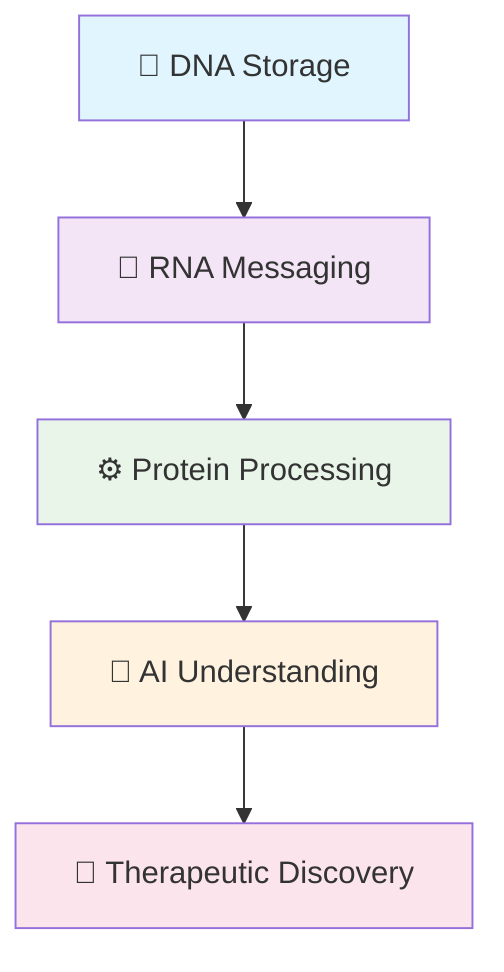

<div align="center">

# 🧬 Ananaya Jain 🤖

### *Computational Biologist • Molecular Storyteller • Digital Biology Architect*

[](https://www.linkedin.com/in/ananaya-jain)
[](mailto:ananayajain2024@gmail.com)
[](https://github.com/Ananaya-J)

```ascii
     🧬 DNA → RNA → PROTEIN → AI → DISCOVERY 🚀
    ╔════════════════════════════════════════╗
    ║  "Teaching computers to speak biology"  ║
    ╚════════════════════════════════════════╝
```

</div>

---

## 🌟 The Intersection of Biology and Code


I exist at the fascinating crossroads where **molecular biology meets artificial intelligence**, where protein folding patterns become machine learning features, and where genomic variants tell stories of human evolution and disease. 

My work revolves around a simple yet profound belief: 

> **🎯 Every biological system is a computational problem waiting to be solved**

<br clear="right"/>

---

## 🧠 My Philosophical Approach

<div align="center">



</div>

Biology is fundamentally **information processing at the molecular level**. DNA serves as storage, RNA as messaging, and proteins as the executive processors. I approach biological research as a systems engineer would approach a complex distributed computing network.

<details>
<summary>🔍 <strong>What drives my research</strong></summary>

- 🎯 The conviction that "undruggable" proteins are simply targets we haven't learned to speak to yet
- 🧬 The belief that precision medicine should be as personalized as a fingerprint  
- ⚡ The understanding that molecular dynamics simulations are windows into biological reality
- 🚀 The vision that AI can accelerate drug discovery from decades to years

</details>

---

## 🎨 The Art of Molecular Engineering

<table>
<tr>
<td width="50%">

### 🔑 Molecular Architecture
I see molecular docking not just as computational chemistry, but as **molecular architecture**—designing keys for locks we're still learning to understand.

</td>
<td width="50%">

### 🕸️ Knowledge Graphs
I build digital ecosystems where genes, proteins, metabolites, and phenotypes can communicate across traditional research silos.

</td>
</tr>
</table>

<div align="center">

```ascii
    🔑 + 🔒 = 💊
   Drug   Target   Therapy
     ↓      ↓       ↓
  [Ligand][Protein][Healing]
```

</div>

---

## ⚡ Computational Philosophy


### 🚀 **HPC as Biological Time Travel**
Using **ADA supercomputing infrastructure** and **AWS cloud platforms**, I can simulate microseconds of protein motion that would take months to observe experimentally. This isn't just computation—it's temporal archaeology.

### 🧠 **ML as Pattern Recognition in Life**
Every algorithm I develop is an attempt to teach computers to recognize the patterns that evolution has been writing for billions of years.

<br clear="left"/>

---

## 🌈 The Interdisciplinary Mind

<div align="center">

| 🧪 **Wet Lab** | ↔️ | 💻 **Dry Lab** |
|:---:|:---:|:---:|
| Pipetting DNA | ⚡ | Configuring AWS |
| Cell Culture | 🔄 | Training Models |
| Microscopy | 🔗 | Python Scripts |

</div>

<br>

> *"The future of biological research lies not in choosing between computational and experimental approaches, but in creating seamless workflows where each informs and enhances the other."*

---

## 🎭 Research Aesthetic

<details>
<summary>🧬 <strong>Precision Medicine as Personalized Computation</strong></summary>

Every individual's genome is a unique algorithm. My pharmacogenomics work treats drug response prediction as personalized software optimization—finding the right therapeutic parameters for each individual's biological operating system.

</details>

<details>
<summary>🎬 <strong>Structural Biology as Molecular Cinema</strong></summary>

Protein structures aren't static sculptures; they're dynamic performances. Through molecular dynamics simulations, I direct molecular movies, watching how proteins breathe, flex, and dance with their ligand partners.

</details>

<details>
<summary>🐛 <strong>Genomics as Evolutionary Debugging</strong></summary>

Disease-causing mutations are essentially bugs in the human genetic code. My variant analysis work involves debugging these biological programs, understanding how single nucleotide changes can crash entire physiological systems.

</details>

---

## 🚀 The Future I'm Building

<div align="center">

```ascii
         🌍 VISION 2030 🌍
    ╔═══════════════════════════╗
    ║  🤖 AI-Human Collaboration ║
    ║  🌐 Democratized Medicine  ║
    ║  🔗 Connected Knowledge    ║
    ║  👥 Virtual Patients       ║
    ╚═══════════════════════════╝
```

</div>

<table align="center">
<tr>
<td align="center">🤖<br><strong>AI-Human<br>Collaboration</strong></td>
<td align="center">🌐<br><strong>Democratized<br>Medicine</strong></td>
<td align="center">🔗<br><strong>Connected<br>Knowledge</strong></td>
<td align="center">👥<br><strong>Virtual<br>Patients</strong></td>
</tr>
</table>

---

## 🧘 Technical Meditation


Programming, for me, is a form of **scientific meditation**. Whether I'm writing Python scripts or developing React applications, coding becomes a dialogue with biological complexity.

### 🗣️ Speaking Biology's Languages:
- **🐍 Python** → Data wrangling
- **📊 R** → Statistical analysis  
- **🗃️ SQL** → Relationship queries
- **⚡ Bash** → Workflow orchestration

<br clear="right"/>

---

## 📜 Personal Research Manifesto

<div align="center">

</div>

I believe that the most profound scientific discoveries happen at **interfaces**—between disciplines, between scales, between the digital and biological worlds. My research exists in these liminal spaces, translating molecular language into computational insights and back again.

<div align="center">

```ascii
    🧬 ←→ 💻 ←→ 🤖 ←→ 💊
   Biology Code  AI   Medicine
     ↓     ↓     ↓      ↓
   [Understanding Life's Algorithms]
```

</div>

Every protein I dock, every genome I analyze, every model I train is part of a larger project: **teaching computers to understand life**, and using that understanding to improve human health.

---

<div align="center">

## 🎯 Current Focus

**Building the computational infrastructure for the next generation of biological discovery**

*Where artificial intelligence and human intuition collaborate to decode the fundamental algorithms of life*

<br>

🌍 **Location:** India  
🤝 **Status:** Open to collaborative research opportunities worldwide

---

### 💭 *"In the end, we are all just atoms trying to understand atoms, using patterns to decode patterns, writing code to crack the ultimate code—life itself."*

<br>


</div>
